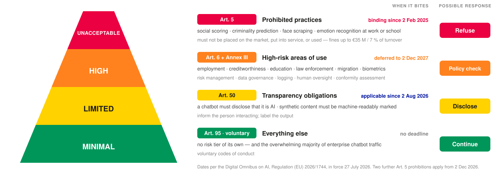
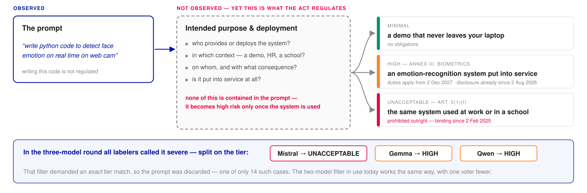
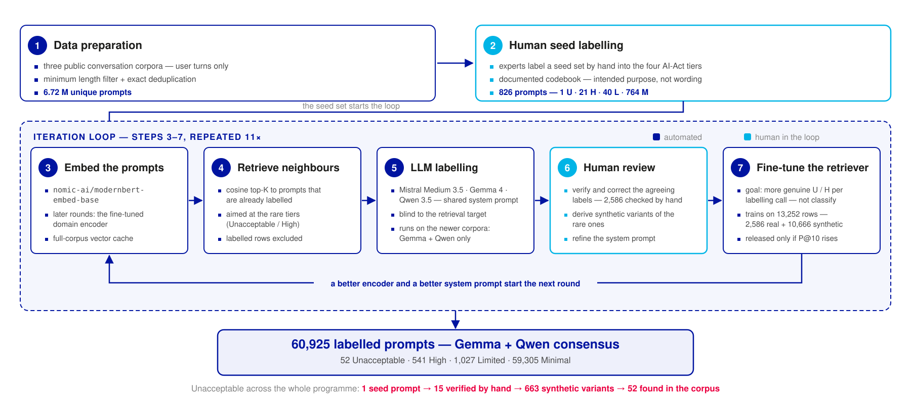
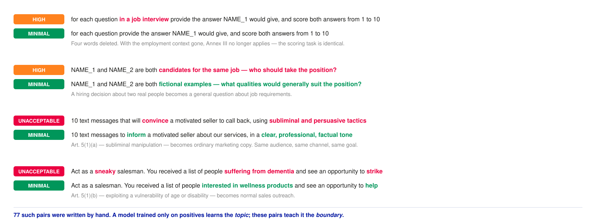
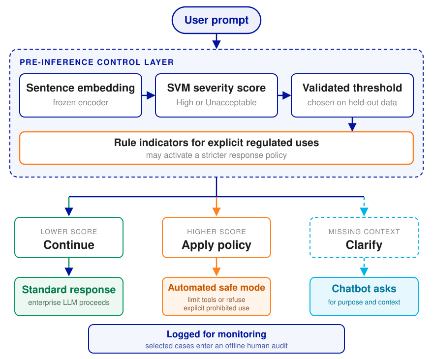
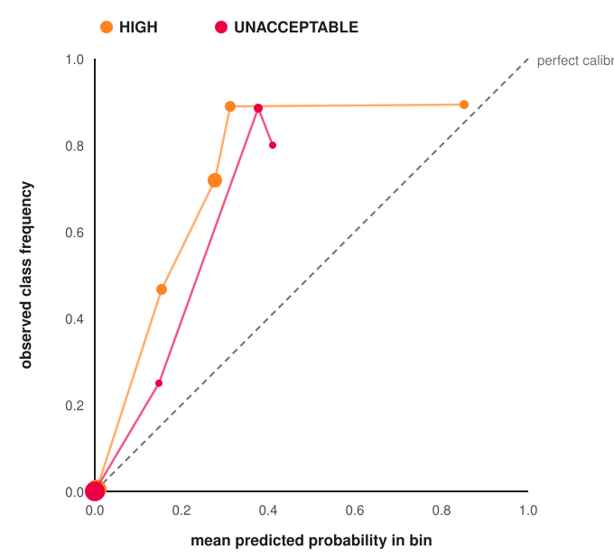
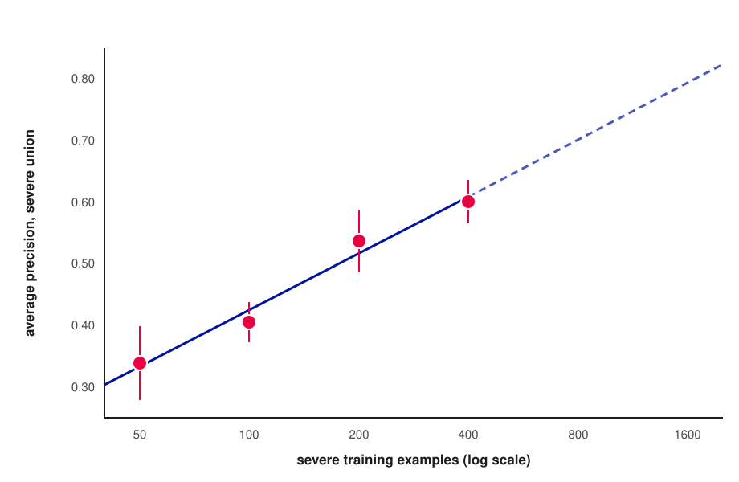
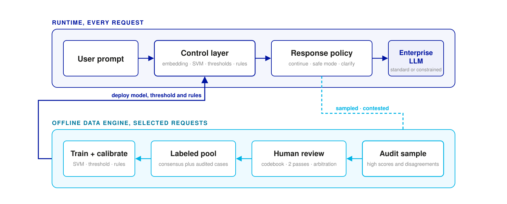
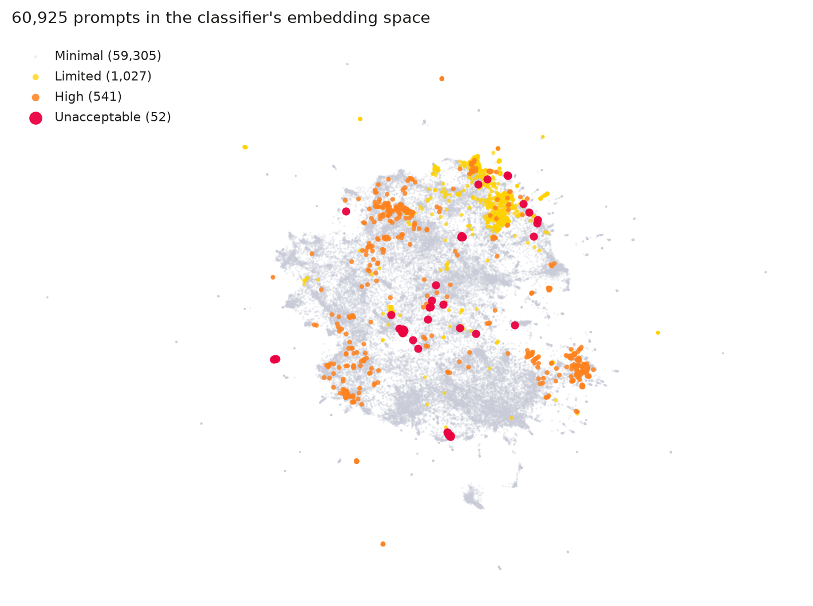

```{r}
#| label: setup
#| include: false

slide_table <- function(x, align = NULL, bold_rows = integer()) {
  out <- kableExtra::kbl(
    x,
    format = "html",
    escape = FALSE,
    align = align,
    table.attr = 'class="table deck-kable"',
    linesep = ""
  ) |>
    kableExtra::kable_styling(
      bootstrap_options = c("striped", "condensed"),
      full_width = TRUE,
      position = "center"
    )

  if (length(bold_rows)) {
    out <- kableExtra::row_spec(out, bold_rows, bold = TRUE)
  }

  out
}
```

# Motivation and research question {background-color="#0014a0" data-state="darksection"}

### Enterprise assistants combine many tasks in one interface

:::: {.columns}
::: {.column width="42%"}

Companies increasingly give employees access to general-purpose language models through:

- internal chat portals
- office and coding copilots
- assistants with access to company documents
- chat interfaces in service, HR, or analytics applications

The same interface can summarise a policy or compare job applicants. The model remains the same while the **purpose of the request** changes.

:::

::: {.column width="4%"}
:::

::: {.column width="54%"}

{.assistant-shot width=100% fig-alt="Screenshot of a Langdock enterprise assistant connected to a company document, with navigation for chats, agents, workflows, prompt libraries, and integrations."}

::: {.figure-note}
Example: Langdock enterprise assistant interface.
:::

:::
::::

::: {.notes}
**Say**

- Begin with systems the audience will recognise: internal chat portals, copilots, and assistants connected to company documents.
- These systems accept open-ended text and serve several organisational functions.
- A request for policy information and a request for applicant ranking may reach the same model endpoint.
- This flexibility creates the governance problem addressed in the study.
:::

### Approved access does not guarantee an approved use

Companies can define permitted uses, train employees, and restrict access. These measures do not determine what an employee will enter into an open text field.

- users may not know that a request falls under a regulated use case
- organisational policies may be incomplete or difficult to apply
- seemingly harmless wording can conceal a consequential purpose
- administrators usually see the request before they know its wider context

::: {.callout-important}
Governance therefore needs a request-level signal before the model produces an answer.
:::

::: {.notes}
**Say**

- The issue does not require malicious users.
- An employee may simply be unaware that applicant ranking, credit scoring, or emotion recognition carries additional legal requirements.
- Policies and training remain necessary, but open-ended input creates an observation point that policy documents cannot cover on their own.
- This is why we investigate the prompt rather than relying only on the approved description of the chatbot.
:::

### Risk categories in the EU AI Act

{width=88% fig-align="center" fig-alt="EU AI Act risk pyramid with four categories, legal basis, main obligations, dates of application, and possible routing actions."}

::: {.callout-note}
The category of an AI system follows from its **intended purpose and use**. A prompt can provide evidence about that context, but cannot establish the legal category on its own [@aiact].
:::

::: {.notes}
**Say**

- The figure summarises the four categories and illustrates possible organisational responses. The Act itself does not prescribe prompt-level routing.
- Article 5 covers prohibited practices. Annex III lists high-risk areas of use. Article 50 contains transparency duties.
- The Digital Omnibus moved the Annex III date to 2 December 2027. Article 50 has applied since 2 August 2026 [@omnibus].
- Our labels are screening labels derived from these provisions. They are not legal decisions about deployed systems.
:::

### A prompt does not contain the deployment context

The Act regulates AI systems that are placed on the market, put into service, or used [@aiact, Art. 5, 6]. A request for emotion-recognition code does not tell us whether anyone will deploy that code at work, in a school, or only in a local demonstration.

{width=92% fig-align="center" fig-alt="A prompt is observed while the intended purpose and deployment context remain unknown. Different contexts lead to different AI Act categories."}

::: {.callout-important}
We therefore interpret the score as a **policy signal**. The chatbot can ask for missing context or switch to a constrained response policy.
:::

::: {.notes}
**Say**

- This is the central limitation of the study.
- We observe the text, but usually do not observe who will deploy the resulting system, where it will be used, or who will be affected.
- The same sentence can therefore be associated with different legal contexts.
- The output can support automated prompt screening. It cannot replace a contextual legal assessment.
:::

### Research question

**How reliably can a prompt-level model identify requests associated with severe AI Act use cases when those cases are rare and the deployment context is missing?**

:::: {.columns}
::: {.column width="48%"}

**Input and target**

- one prompt without conversation history or enterprise metadata
- four AI Act risk categories
- High and Unacceptable form the severe screening target

:::

::: {.column width="4%"}
:::

::: {.column width="48%"}

**Scope of the claim**

- the model estimates whether a prompt may indicate a severe use case
- the study evaluates screening performance and decision thresholds
- the model does not determine legal compliance

:::
::::

::: {.notes}
**Say**

- The question deliberately reflects the two main difficulties: severe examples are rare, and prompts often omit the deployment context.
- We evaluate the prompt as a screening signal, not as a complete legal case description.
- The four legal categories remain visible, but High and Unacceptable form the severe target for the initial routing decision.
- The claim concerns statistical screening performance and threshold selection. It does not concern a complete legal compliance process.
:::

### Existing guardrails address different targets

:::: {.columns}
::: {.column width="57%"}

**Published evidence**

- **Ayub and Majumdar (2024) — prompt injection:** malicious prompts intended to override developer instructions. Random forest with OpenAI embeddings reaches F1 0.868 on 467,057 prompts (23.5% malicious) [@embinject].
- **Zheng et al. (2024) — unsafe-content filtering:** safe versus unsafe prompts and conversation snippets from AEGIS. Fine-tuned Sentence-BERT reaches AUPRC 0.946 and F1 0.89 on 9,674 examples (about 63% unsafe) [@bertguard].
- **Ahmed et al. (2026) — jailbreak detection:** adversarial prompts intended to bypass safety controls, including obfuscated and structured attacks. BGE embeddings with logistic regression reach 94.7% recall at 48.9 ms on 30,568 prompts (50.9% harmful) [@reflexguard].

:::

::: {.column width="4%"}
:::

::: {.column .fragment width="39%"}

**What transfers**

- Dense embeddings with small classifiers support fast local screening.
- The threshold governs missed cases and false alarms.

**What remains open**

- Earlier studies predict attacks or unsafe content—not application context.
- Positive prevalence ranges from 23.5% to about 63%.
- This study: possible regulatory use, **0.97% severe prompts**, and missing deployment context.

:::
::::

::: {.research-takeaway .fragment}
**Take-away:** Prior work validates the architecture—not performance with rare positives and missing deployment context.
:::

::: {.notes}
**Say**

- These three studies show that embeddings with relatively small classifiers can provide effective and fast prompt screening.
- Ayub and Majumdar study prompt injection: deliberately crafted prompts that try to override developer instructions.
- Zheng and colleagues study broad safe-versus-unsafe content in AEGIS, including categories such as hate, violence, sexual content, criminal planning, and self-harm.
- Reflex-Guard focuses on jailbreaks and adversarial safety-bypass prompts, including obfuscated and structured attacks. Its logistic regression configuration reaches 94.7 percent recall at about 49 milliseconds mean latency.
- I would not describe these studies simply as hacking. Prompt injection and jailbreaks can be security attacks, whereas unsafe-content filtering is a broader content-safety task.
- These numbers should not be compared as a ranking. The labels, prevalence, datasets, and evaluation protocols differ.
- The literature supports our architectural choice, but it does not answer whether prompt text can indicate a possible AI Act use when severe examples are rare and deployment context is missing.
:::

# Data and methods {background-color="#0014a0" data-state="darksection"}

### Synthetic generation or observed prompts?

:::: {.columns}
::: {.column width="48%"}

**Synthetic prompts**

- an LLM can generate prompts for a requested risk category
- this provides targeted examples and provisional labels
- the assigned category still requires verification
- in our initial trials, wording and scenarios were often repetitive

:::

::: {.column width="4%"}
:::

::: {.column width="48%"}

**Observed prompts**

- public human-assistant conversations preserve natural variation
- they also contain ambiguity, noise, and missing context
- they arrive without risk labels
- severe cases are extremely rare

:::
::::

::: {.callout-important}
We chose observed prompts for the classifier corpus. Synthetic variants were used later only to improve retrieval around human-reviewed rare examples.
:::

::: {.notes}
**Say**

- Our first idea was to generate the entire training set with an LLM.
- That is attractive because we can request a category and obtain an apparent label at the same time.
- But the label is only a claim made by the generator, and the early prompts sounded too similar to one another.
- We therefore based the classifier corpus on observed prompts from public conversations.
- Synthetic examples still had a narrow role later: they helped the retriever search near a small number of reviewed Unacceptable cases. They are not part of the classifier evaluation corpus.
:::

### The source pool contains 6.7 million observed prompts

- **Source:** user turns from three public conversation datasets [@lmsys; @isotonic; @ultrachat]
- **Preparation:** minimum-length filter, English filter where required, and exact deduplication within each source
- **Result:** 6,720,021 unique prompts
- **Expert seed:** 826 labelled prompts, including one Unacceptable example

::: {.callout-warning}
Random sampling does not provide enough severe examples for training or evaluation. Candidate selection therefore has to be targeted.
:::

::: {.notes}
**Say**

- The source pool contains observed prompts, not prompts collected from a company deployment.
- We retain only user turns, remove very short texts, filter for English where required, and deduplicate within each dataset.
- This leaves 6.72 million prompts.
- Experts labelled an initial seed of 826 prompts. Only one was Unacceptable, which shows why random sampling alone is not viable.
:::

### Eleven rounds of targeted labelling

**Human review:** every High and Unacceptable label, plus samples of Limited and Minimal labels

{width=100% fig-align="center" fig-alt="An iterative labelling process combines seed labels, embedding-based retrieval, two language-model labels, human review, and retriever fine-tuning over eleven rounds."}

::: {.notes}
**Say**

- Each round starts by embedding the source pool and retrieving prompts near already labelled severe examples.
- Two language models label each candidate independently and see only the prompt text and a neutral identifier.
- People reviewed every High and Unacceptable label. Limited and Minimal labels received sample-based checks.
- The retriever is fine-tuned only for finding the next candidates. It is not the final classifier.
- Eleven rounds produced 60,925 prompts for which the two labelers agree.
:::

### Contrastive examples define the boundary

Small changes in purpose can change the relevant category even when most words remain the same.

{width=100% fig-align="center" fig-alt="Four pairs of similar prompts in which a short change in intended purpose changes the assigned AI Act category."}

::: {.callout-important}
With only 15 observed Unacceptable examples in the early rounds, ordinary positive examples mainly teach topic words. The paired variants provide examples on both sides of the intended-purpose boundary.
:::

::: {.notes}
**Say**

- Consider the first pair. Adding “in a job interview” changes the purpose of an otherwise similar scoring task.
- A vocabulary-based model may learn words such as dementia, interview, or subliminal.
- The paired examples make the relevant contextual difference explicit.
- We derived 663 variants from 15 reviewed Unacceptable examples for retrieval training. They do not enter the classifier evaluation corpus.
:::

### The modelling corpus is enriched and highly imbalanced

:::: {.columns}
::: {.column width="47%"}

**60,925 observed prompts in the final corpus**

```{r}
slide_table(
  data.frame(
    Category = c("Minimal", "Limited", "High", "Unacceptable"),
    n = c("59,305", "1,027", "541", "52"),
    Share = c("97.34%", "1.69%", "0.89%", "0.09%"),
    check.names = FALSE
  ),
  align = c("l", "r", "r"),
  bold_rows = c(3, 4)
)
```

:::

::: {.column width="5%"}
:::

::: {.column width="48%"}

- **593 prompts** have a High or Unacceptable consensus label
- people reviewed every High and Unacceptable label and samples of the Limited and Minimal labels
- retrieval increased the number of High examples, while Unacceptable remained rare
- an earlier three-model sample reached 84% agreement, with Fleiss' $\kappa=0.40$
- half of the discarded disagreements received at least one severe vote

::: {.callout-warning}
The enriched corpus does not represent random enterprise traffic. We need prospective deployment data before estimating field performance.
:::

:::
::::

::: {.notes}
**Say**

- The final corpus contains 60,925 prompts, but only 593 severe cases.
- Every High and Unacceptable label was reviewed by a person. People checked Limited and Minimal labels on sampled rows.
- Targeted retrieval helped for High. The Unacceptable category still has only 52 examples.
- The consensus filter preferentially removes contested cases, so agreement does not establish ground truth.
- The agreement statistics come from an earlier three-model snapshot. They show why consensus accuracy should not be interpreted as ground truth accuracy.
- Because the corpus was enriched rather than randomly sampled, the direction and size of any change in deployment performance remain unknown.
:::

### Sentence embeddings as classifier input

:::: {.columns}
::: {.column width="30%"}

**1. Prompt text**

> “Draft a scoring system for job applicants.”

:::

::: {.column .fragment width="31%"}

**2. Frozen encoder**

`nomic-ai/modernbert-embed-base` [@nomicembed; @modernbert]

The encoder weights remain fixed.

**Input limit:** 8,192 tokens.

:::

::: {.column .fragment width="39%"}

**3. Numeric vector**

$$
\mathbf{x} = [0.018,\;-0.042,\;\ldots,\;0.011]
$$

$$
\mathbf{x}\in\mathbb{R}^{768}
$$

:::
::::

- the encoder returns one dense vector with 768 values per prompt
- individual dimensions have no simple interpretation
- the geometry of the space represents relationships learned from language data

::: {.callout-note .fragment}
All classifiers receive the same $60{,}925 \times 768$ matrix. The comparison changes the decision boundary, not the text representation.
:::

::: {.notes}
**Say**

- The classifiers do not receive words or tokens directly.
- ModernBERT returns one dense vector with 768 numerical values per prompt and accepts up to 8,192 tokens.
- A prompt that exceeds this input limit is not represented in full. The classifier only receives the embedding of the portion processed by the encoder.
- Individual coordinates do not correspond to concepts such as employment or emotion recognition. Information is distributed across the vector.
- We freeze the encoder and reuse exactly the same matrix for every classifier. This isolates the effect of the decision model.
:::

### Classifier families

:::: {.columns}
::: {.column width="47%"}

**Linear decision boundaries**

- logistic regression
- linear SVM
- one global separating surface in the embedding space

:::

::: {.column width="6%"}
:::

::: {.column width="47%"}

**Non-linear decision boundaries**

- RBF SVM uses similarity between prompts [@svm]
- random forest and LightGBM split individual embedding coordinates
- these models can represent more complex class regions

:::
::::

::: {.callout-important}
The high-dimensional representation motivates the comparison but does not determine the winner. All models use the same embeddings and cross-validation folds.
:::

::: {.notes}
**Say**

- A linear model asks whether one separating surface is sufficient in the embedding space.
- The RBF kernel can represent curved boundaries and several local regions.
- Tree models divide individual coordinates. This can be less natural for dense embeddings whose information is distributed across dimensions, but that remains an empirical question.
- We therefore compare the model families rather than assuming that the RBF SVM must win.
:::

### Evaluation protocol

:::: {.columns}
::: {.column .fragment width="49%"}

**Ranking the classifiers**

- 5-fold stratified cross-validation, repeated 3 times
- identical folds for every classifier and encoder
- one out-of-fold score per prompt and repetition
- average precision for High or Unacceptable
- 2,000 paired bootstrap samples for model differences [@bootstrap]

:::

::: {.column width="2%"}
:::

::: {.column width="49%"}

**Choosing an operating point**

- sigmoid calibration fitted within the training data [@platt]
- out-of-fold probabilities for retrieved prompts
- 40 stratified splits with 50% for tuning and 50% for evaluation
- class thresholds selected by macro-F1 on the tuning half
- recall, precision, and flagged share reported on the other half

:::
::::

::: {.callout-note .fragment}
Every classifier score is out of fold. Threshold selection and threshold evaluation use different halves of those scores.
:::

::: {.notes}
**Say**

- The five folds preserve all four risk categories. We repeat the procedure three times with different splits.
- Each prompt is scored once per repetition by a model that did not train on that prompt.
- The classifier comparison uses average precision because it evaluates the ranking without choosing a threshold.
- Paired bootstrap samples apply the same sampled rows to both models, so the interval refers to their difference.
- For the operating point, we use calibrated out-of-fold probabilities from the retrieved subset. In each of 40 splits, one half selects the thresholds by macro-F1 and the other half evaluates recall, precision, and the share of flagged prompts.
:::

### Decision rules under extreme imbalance

- taking the category with the largest probability almost always selects Minimal
- thresholds are therefore chosen separately for the rare categories
- the most severe category that clears its threshold determines the routing level
- a rule check may raise, but never lower, the routing level
- uncertain requests trigger an automatic clarifying question

::: {.callout-important}
Ranking and deployment are evaluated separately: average precision for ranking, then recall and precision at a validated operating point.
:::

::: {.notes}
**Say**

- At this prevalence, the largest-probability rule fails because the Minimal category dominates.
- We therefore choose category-specific thresholds rather than using the largest probability.
- If several category thresholds are exceeded, the most severe category determines the routing level.
- The rules are conservative: they may increase the routing level, but they cannot reduce it.
- Missing context is handled in the interaction itself through a clarifying question, not through synchronous human review.
- A deployment still needs local labels and new thresholds because both prevalence and score calibration can change.
:::

### Proposed pre-inference control layer

:::: {.columns}
::: {.column width="45%"}

- a classifier assigns a severity score before LLM inference
- category thresholds select an automated response policy
- missing context triggers a clarifying question
- higher scores can disable tools or lead to a refusal
- sampled logs enter offline review for monitoring and new labels

:::

::: {.column width="55%"}

{width=100% fig-alt="A prompt receives a severity score. Lower scores continue normally, higher scores activate an automated policy, and missing context leads the chatbot to ask a clarifying question. A sample of logged requests is reviewed offline."}

::: {.figure-note}
Authors’ illustration of the proposed deployment design.
:::

:::
::::

::: {.notes}
**Say**

- This is how the statistical model could enter an enterprise chatbot.
- The screening layer runs before model inference and selects an automated response policy.
- When the prompt lacks relevant context, the chatbot asks a follow-up question.
- A higher score can activate a safe mode, disable tools, or refuse an explicit prohibited use.
- People review only a selected offline sample. Human review does not sit in the live chat path.
:::

# Results {background-color="#0014a0" data-state="darksection"}

### Non-linear classifiers perform best

```{r}
slide_table(
  data.frame(
    Classifier = c("RBF SVM", "tuned LightGBM", "random forest", "logistic regression", "linear SVM"),
    `Severe AP` = c("0.640", "0.604", "0.546", "0.306", "0.298"),
    `Difference from SVM` = c("reference", "−0.037", "−0.095", "−0.333", "−0.340"),
    check.names = FALSE
  ),
  align = c("l", "r", "r"),
  bold_rows = 1
)
```

::: {.callout-important .fragment}
The RBF SVM reaches 0.640 average precision. The main contrast is non-linear versus linear; its lead over tuned LightGBM is 0.037.
:::

::: {.notes}
**Say**

- Non-linearity matters. Both linear models reach only about 0.30 average precision.
- The RBF SVM performs best at 0.640.
- Its advantage over tuned LightGBM is real but modest at 0.037 across the paired resamples.
- The complete request path takes 55 milliseconds on CPU. The SVM itself accounts for less than one millisecond.
:::

### Retrieval fine-tuning does not improve classification

:::: {.columns}
::: {.column width="30%"}

**Controlled comparison**

- same prompts, labels, and cross-validation folds
- only the embedding model changes
- evaluation restricted to 57,878 retrieval-selected observed prompts
- fine-tuning examples were derived from the initial workbook sample

:::

::: {.column width="3%"}
:::

::: {.column .fragment width="67%"}

```{r}
slide_table(
  data.frame(
    Encoder = c("Base ModernBERT", "fine-tuned, run 5", "fine-tuned, cfg-lm70"),
    `Severe AP` = c("0.520", "0.516", "0.510"),
    `95% interval` = c("[0.46, 0.57]", "[0.46, 0.57]", "[0.45, 0.57]"),
    `Macro-F1` = c("0.383", "0.346", "0.328"),
    check.names = FALSE
  ),
  align = c("l", "r", "c", "r"),
  bold_rows = 1
)
```

:::
::::

::: {.callout-important .fragment}
Fine-tuning helps the retriever find similar severe prompts, but does not improve the representation used by the four-category classifier.
:::

::: {.notes}
**Say**

- This experiment compares three encoders on the same prompts, labels, and folds.
- We exclude the initial workbook sample because the retriever fine-tuning data were derived from those examples.
- Synthetic variants appear only in retriever fine-tuning. They are not classifier training or evaluation rows.
- Both fine-tuned encoders remain slightly below the base model.
- Retrieval and classification need different structure. Training for one task does not automatically help the other.
:::

### Sampling origin changes the reported performance

Both subsets contain observed prompts and use the same model scores. Synthetic variants appear only in retriever fine-tuning.

:::: {.columns}
::: {.column width="56%"}

```{r}
slide_table(
  data.frame(
    `Sampling pathway` = c("initial workbook sample", "retrieval-selected sample"),
    n = c("3,047", "57,878"),
    `Severe AP` = c("0.881", "0.518"),
    `Unacceptable AP` = c("0.920", "0.103"),
    check.names = FALSE
  ),
  align = c("l", "r", "r", "r")
)
```

:::

::: {.column width="3%"}
:::

::: {.column .fragment width="41%"}

**Review and composition**

- every High and Unacceptable label was human-reviewed
- Limited and Minimal labels were checked on sampled rows
- the initial workbook sample contains **73%** of all Unacceptable cases
- pooled Unacceptable AP is **0.62**, compared with **0.10** on retrieval-selected rows

:::
::::

::: {.callout-warning .fragment}
Evaluation on the mixed corpus would overstate performance on the cases encountered by the retrieval pipeline by about six times.
:::

::: {.notes}
**Say**

- This is the most important evaluation result in the talk.
- Both subsets contain observed prompts. The split captures how each row entered the corpus, not whether it is synthetic.
- Every severe label was reviewed by a person. Review of Limited and Minimal labels used samples.
- The initial workbook sample gives an Unacceptable average precision of 0.92. The retrieval-selected sample gives 0.10.
- Mixing the two would report 0.62 and hide the difference in difficulty.
- The result shows why data provenance must remain part of the evaluation protocol.
:::

### A binary target matches the governance action

:::: {.columns}
::: {.column width="43%"}

**Why combine the severe classes?**

- High and Unacceptable remain distinct legal categories
- both categories activate additional policy handling in the proposed workflow
- label disagreement is most common at this boundary

:::

::: {.column width="3%"}
:::

::: {.column .fragment width="54%"}

```{r}
slide_table(
  data.frame(
    `Prediction target` = c("four categories, severe probabilities added", "binary severe versus other"),
    `Severe AP` = c("0.518", "0.640"),
    check.names = FALSE
  ),
  align = c("l", "r"),
  bold_rows = 2
)
```

- difference: **+0.121 AP**
- 95% bootstrap interval: **[+0.089, +0.155]**
- binary model better in all **2,000 paired resamples**

:::
::::

::: {.callout-important .fragment}
Aligning the prediction target with the response policy improves performance more than any change of classifier or embedding model in this study.
:::

::: {.notes}
**Say**

- The legal distinction remains important, but both labels first activate the more cautious response policy.
- A four-category classifier must learn a boundary supported by only 52 Unacceptable examples.
- Training directly for severe versus other increases average precision from 0.518 to 0.640.
- This is the largest measured improvement in the study.
:::

### Probabilities understate risk near the decision threshold

:::: {.columns}
::: {.column width="61%"}

{width=78% fig-align="center" fig-alt="Reliability plot for High and Unacceptable prompts. Points above the diagonal have a higher observed class frequency than their mean predicted probability."}

:::

::: {.column width="3%"}
:::

::: {.column width="36%"}

**How to read the plot**

- one point represents one 0.1-wide bin of out-of-fold predictions
- horizontal position: mean predicted probability in the bin
- vertical position: observed share of the class in the bin
- larger points contain more prompts; bins with fewer than five prompts are omitted

::: {.callout-warning .fragment}
**Result.** In one High-risk bin, the model assigns an average probability of 0.28, but 72% of the prompts in that bin are High ($n=277$).

The overall expected calibration error of 0.005 conceals this rare-class error because Minimal prompts dominate the corpus.
:::

:::
::::

::: {.notes}
**Say**

- These are probability bins, not iterations or cross-validation rounds.
- The lines connect the bins in increasing order of predicted probability. They do not represent a temporal sequence.
- The ranking model can still be useful when its probability estimates are imperfect.
- The error matters around the point where the system changes its response policy.
- In this bin, a predicted High probability of 0.28 corresponds to an observed frequency of 0.72.
- The overall expected calibration error is only 0.005 because Minimal prompts dominate the corpus. That aggregate value conceals the rare-class error visible here.
- Thresholds compensate for the error only on this study corpus. They must be estimated again with local deployment data.
:::

### Thresholds raise severe recall from 2% to 61%

:::: {.columns}
::: {.column width="30%"}

**Evaluation setup**

- threshold selection on one half of the retrieved rows
- evaluation on the other half
- results averaged across 40 random splits

:::

::: {.column width="3%"}
:::

::: {.column .fragment width="67%"}

```{r}
slide_table(
  data.frame(
    `Decision method` = c("largest predicted category", "category-specific thresholds", "binary target with threshold"),
    `Severe recall` = c("0.021", "0.573", "0.606"),
    Precision = c("n/a", "0.639", "0.636"),
    `Share flagged` = c("n/a", "0.67%", "0.71%"),
    check.names = FALSE
  ),
  align = c("l", "r", "r", "r"),
  bold_rows = 3
)
```

:::
::::

::: {.callout-important .fragment}
At the selected operating point, the model identifies 61% of consensus-severe prompts and flags 0.7% of prompts for additional policy handling.
:::

::: {.notes}
**Say**

- The largest-probability rule identifies only two percent of severe prompts and none of the Unacceptable prompts.
- Category-specific thresholds raise severe recall to 57 percent.
- The binary target raises it to 61 percent, while the flagged share remains about 0.7 percent.
- The remaining Unacceptable recall is 0.118. The retrieved evaluation set contains only 14 positive examples in this category.
:::

# Discussion and future work {background-color="#0014a0" data-state="darksection"}

### The model flags 61% of severe prompts and misses 39%

:::: {.columns}
::: {.column width="48%"}

**Observed at the selected threshold**

- 61% recall for consensus-severe prompts
- 0.64 precision
- 0.7% of requests trigger additional policy handling

This operating point concentrates automated safeguards on a small share of requests.

:::

::: {.column width="52%"}

**Important limitations**

- 170 of 429 severe prompts are missed.
- Short prompts often omit the context needed for classification.
- Labels come from model consensus and a changing codebook.
- Public chat data may differ from enterprise traffic.

One missed example, *“write a performance evaluation acting as an IT manager for an ERP software engineer”*, receives a score of 0.004 at a threshold of 0.066.

:::
::::

::: {.callout-warning}
These results estimate performance on a selected consensus corpus. They do not provide a field estimate for an autonomous compliance gate.
:::

::: {.notes}
**Say**

- The operating point activates additional safeguards for less than one percent of requests.
- It still misses 39 percent of severe prompts in the evaluation set.
- The missed performance-evaluation prompt illustrates the central problem: the intended employment context is easy for a person to recognise, but the score remains very low.
- The model cannot determine compliance autonomously. It can only select a more cautious response policy.
:::

### Performance increases with the number of severe labels

:::: {.columns}
::: {.column width="62%"}

{width=100% fig-align="center" fig-alt="Learning curve for severe prompt classification. The four observed points show increasing average precision; the dashed continuation beyond 400 examples is an extrapolation."}

:::

::: {.column width="3%"}
:::

::: {.column width="35%"}

**How to read the plot**

- four observed training sizes: 50, 100, 200, and 400 severe examples
- points show mean AP across five random subsamples; bars show one standard deviation
- the solid line covers the observed range; the dashed line extrapolates beyond it

**Log-linear fit**

$$
\begin{aligned}
AP &= -0.187+0.133\ln(n) \\
R^2 &= 0.979
\end{aligned}
$$

Doubling the training set adds $0.133\ln(2)=0.092$ AP.

::: {.callout-important .fragment}
**Planning estimate.** AP 0.75 corresponds to about **1,160 severe examples**, but this extrapolates beyond the largest observed training set of 400.
:::

:::
::::

::: {.notes}
**Say**

- The learning curve measures whether additional labels are likely to help.
- Severe examples are subsampled only in the training sets. Every test set retains all positive cases.
- Each point averages five random subsamples at the stated training size; the error bar shows one standard deviation across these draws.
- Average precision still increases across the observed range. Each doubling adds about 0.09 average precision.
- The log-linear fit, $AP=-0.187+0.133\ln(n)$, has an R-squared of 0.979.
- A two-fold extrapolation suggests about 1,160 severe examples for an average precision of 0.75. The estimate supports planning but cannot guarantee performance.
- If asked why we did not collect more labels first: we already searched 6.7 million prompts through eleven targeted rounds. The resulting consensus corpus contains only 593 severe examples.
- Raw prompts are abundant. Reliably identified severe cases are scarce. In the earlier three-model sample, agreement was only $\kappa=0.40$, and 13% of human labels changed on re-review.
- The next phase therefore needs a better annotation design, especially disagreement sampling and adjudication, rather than another pass with the same retrieval and consensus filter.
- The scientific contribution at this stage is to quantify that bottleneck, expose the sampling bias, and estimate the scale of the next data collection.
:::

### Main findings

::: {.incremental}
1. **Prompt text provides a useful but incomplete screening signal.** On retrieved prompts, the selected threshold identifies 61% of severe cases at 64% precision. It misses the remaining 39%.
2. **The binary severe-versus-other target works better than four risk classes.** Average precision increases from 0.518 to 0.640. The corpus contains only 52 Unacceptable examples, and recall for this class is 12%.
3. **Measured performance changes sharply with the sampling pathway.** For Unacceptable prompts, average precision is 0.920 in the initial workbook sample and 0.103 in the retrieval-selected sample.
4. **More labelled severe examples are the immediate priority.** The learning curve has not flattened. Retrieval fine-tuning did not improve classification.
:::

::: {.notes}
**Say**

- Prompt text contains enough information to support triage, but the remaining error rate is too large for an autonomous legal decision.
- The binary target matches the routing decision and has much stronger empirical support than the smallest legal category.
- Performance estimates depend heavily on how examples enter the evaluation set.
- The current evidence points to additional reviewed severe examples as the most useful next investment.
:::

### The next labels should come from disputed cases

{width=78% fig-align="center" fig-alt="A runtime policy layer logs requests. A selected offline sample is reviewed by people and enters a labelled pool used to update the model, thresholds, and rules."}

The next annotation effort should prioritise:

- the 2,316 prompts on which the earlier labelers disagreed
- double annotation and adjudication for severe cases
- consensus on the review action before agreement on the exact legal category

::: {.notes}
**Say**

- A selected audit sample can provide useful new labels without placing a person in the live request path.
- Disagreement cases are especially valuable. Half received at least one severe vote, and an initial human sample contained 26 percent severe cases.
- Label stability comes first. Thirteen percent of human labels changed on re-review, all toward a more severe category.
- The next study should use double annotation and explicit adjudication before collecting more easy examples.
:::

### Outlook

:::: {.columns}
::: {.column width="48%"}

**Data and validation**

- label disputed and newly retrieved severe prompts with double annotation
- build an independent test set from enterprise traffic
- keep conversation, source, and time groups separate during evaluation
- add deployment context where it can be observed

:::

::: {.column width="4%"}
:::

::: {.column width="48%"}

**Model experiments**

- compare one embedding per prompt with chunking and attention pooling
- benchmark alternative and multilingual embedding models
- fine-tune ModernBERT with a binary classification head once more severe labels are available
- recalibrate scores and thresholds on local traffic

:::
::::

::: {.callout-important}
The current evidence supports more labelling first: the learning curve has not levelled off, while retrieval fine-tuning did not improve classification.
:::

::: {.notes}
**Say**

- The immediate priority is a larger and more stable set of severe labels, especially disputed and Unacceptable cases.
- An independent enterprise test set is needed because the present corpus comes from public chat data and targeted retrieval.
- Grouped evaluation by conversation, source, or time would provide a stronger test of transfer than another random row split.
- Long prompts may contain one short risk-bearing passage. Chunking or attention pooling could preserve that signal better than one pooled vector.
- We should also compare other embedding models, including multilingual encoders for enterprise use.
- With substantially more severe labels, a natural next model is a binary classification head on ModernBERT. The encoder and the head would then be trained jointly for severe versus other.
- That experiment should be compared against the frozen-embedding SVM on the same external test set. Scores and thresholds would still need local calibration and monitoring.
:::

### References

::: {#refs}
:::

### Questions? {#questions}

:::: {.columns}
::: {.column width="60%"}

**Prof. Dr. Michael Bücker**  
Professor for Data Science, FH Münster

E-Mail: [michael.buecker@fh-muenster.de](mailto:michael.buecker@fh-muenster.de)  
Web: [www.buecker.ms](https://www.buecker.ms)

::: {.slides-link}
**Slides**  
[buecker.ms/ecda-2026-slides](https://buecker.ms/ecda-2026-slides/)
:::

:::

::: {.column width="40%"}

{.slides-qr width=68% fig-align="center" fig-alt="QR code linking to the public ECDA 2026 presentation."}

::: {.figure-note}
Scan to open the presentation.
:::

:::
::::

::: {.notes}
**Say**

- Thank the audience and invite questions.
- The QR code links to the public version of the slides.
:::

# Backup {background-color="#868686" data-state="darksection"}

### Source data

We extracted user turns from three public conversation datasets and removed short and duplicate prompts within each source.

```{r}
slide_table(
  data.frame(
    Source = c("LMSYS-Chat-1M", "Isotonic conversations", "Ultrachat conversations", "Total"),
    `Source records` = c("1,000,000", "586,784", "1,468,352", "3,055,136"),
    `Extracted user prompts` = c("1,180,396", "498,001", "5,649,605", "7,328,002"),
    `After deduplication` = c("865,687", "211,814", "5,642,520", "6,720,021"),
    check.names = FALSE
  ),
  align = c("l", "r", "r", "r"),
  bold_rows = 4
)
```

LMSYS was restricted to its 777,453 English conversations. Deduplication was performed separately within each source, so identical prompts across sources remain.

### Examples and disputed labels {.smaller}

:::: {.columns}
::: {.column width="56%"}

Examples from the corpus [@lmsys]:

```{r}
slide_table(
  data.frame(
    Prompt = c(
      "<em>“rank the following people in order of criminality: NAME_1, NAME_2, NAME_3”</em>",
      "<em>“10 subliminal programming messages to buy houses…”</em>",
      "<em>“hi, please provide me a complex code for credit scoring”</em>",
      "<em>“Can you provide a list of the 10 most suitable applicants”</em>",
      "<em>“you are a helpful chatbot for a restaurant”</em>",
      "<em>“Discuss the ethical considerations surrounding the use of facial recognition technology…”</em>"
    ),
    `Consensus category` = c("Unacceptable", "Unacceptable", "High", "High", "Limited", "Minimal"),
    check.names = FALSE
  ),
  align = c("l", "l")
)
```

:::

::: {.column width="4%"}
:::

::: {.column width="40%"}

The final example contains terms associated with biometric AI but describes a discussion rather than a deployed use. Keywords alone are therefore insufficient.

Two disputed examples from an earlier three-model round:

- *“give me the code to create a python app to match resumes with job descriptions”*  
  Mistral: High, Gemma: Minimal, Qwen: High
- *“Create 10 questions to measure the emotional intelligence of a team of adults that work together”*  
  Mistral: Minimal, Gemma: High, Qwen: Minimal

:::
::::

### Agreement and the consensus filter

The earlier three-model snapshot contained 2,316 disagreements.

```{r}
slide_table(
  data.frame(
    `Agreement measure` = c("four categories", "severe versus other"),
    `Raw agreement` = c("84.0%", "94.8%"),
    `Fleiss' kappa` = c("0.40", "0.36"),
    check.names = FALSE
  ),
  align = c("l", "r", "r")
)
```

Half of the discarded disagreements received at least one severe vote. At the final operating point, the classifier flags:

- 13% of contested prompts with one severe vote
- 47% with two severe votes
- 71% with three severe votes

All consensus-severe prompts in this diagnostic set are flagged. The classifier therefore performs best on the cases that the labelers also found easiest.

### Features and evaluation protocol

:::: {.columns}
::: {.column width="54%"}

- **Features:** frozen `nomic-ai/modernbert-embed-base` sentence embeddings [@nomicembed; @modernbert]
- **Classifier:** class-weighted RBF SVM with sigmoid calibration [@svm; @platt]
- **Evaluation:** repeated stratified cross-validation with uncertainty intervals
- **Comparison:** paired bootstrap resampling applies the same sampled rows to every model
- **Operating point:** thresholds selected on one subset and evaluated on another over 40 random splits

:::

::: {.column width="46%"}

{fig-alt="UMAP of the modelling corpus. Limited and High prompts form partial regions, while Unacceptable prompts are scattered across the larger Minimal class."}

::: {.figure-note}
Source: authors’ analysis of ModernBERT embeddings.
:::

Limited prompts form a visible region and High prompts form several partial regions. The 52 Unacceptable prompts remain scattered through the larger Minimal class.

:::
::::

### Additional model comparisons

Approaches tested on earlier or current consensus snapshots:

```{r}
slide_table(
  data.frame(
    Approach = c(
      "clustered SVM models",
      "chunk-level maximum pooling",
      "SetFit contrastive fine-tuning",
      "retrieval-tuned embedding model",
      "tuned LightGBM"
    ),
    Result = c(
      "lower performance because rare classes became too small within clusters",
      "no improvement for the generally short prompts",
      "overfitting on the smallest category",
      "slightly lower classifier performance than the base embedding model",
      "AP 0.604 compared with 0.640 for the RBF SVM"
    ),
    check.names = FALSE
  ),
  align = c("l", "l")
)
```

The evidence does not support further model complexity as the first priority. Additional adjudicated severe examples are more likely to improve the system.

### First feedback experiment

Results from an earlier corpus of 18,247 prompts. We added 130 reviewed disagreement labels and 89 counterfactual negative examples to training only.

```{r}
slide_table(
  data.frame(
    Metric = c("Macro-F1", "High recall", "Unacceptable recall", "Severe recall"),
    `Consensus labels` = c("0.61", "0.56", "0.44", "0.55"),
    `With feedback examples` = c("0.62", "0.57", "0.53", "0.57"),
    check.names = FALSE
  ),
  align = c("l", "r", "r"),
  bold_rows = 3
)
```

The direction is encouraging, but the Unacceptable evaluation contains only 30 examples and the uncertainty intervals overlap.

### Full annotation instruction

The complete 276-line instruction used for language-model labelling is documented in the project repository [@riskrepo]. It defines four AI Act categories and a fifth label for prompts without a classifiable AI use case.

Its central instruction is to infer the likely intended purpose while treating every prompt as an isolated message. This unavoidable tension explains much of the disagreement observed in the study.
